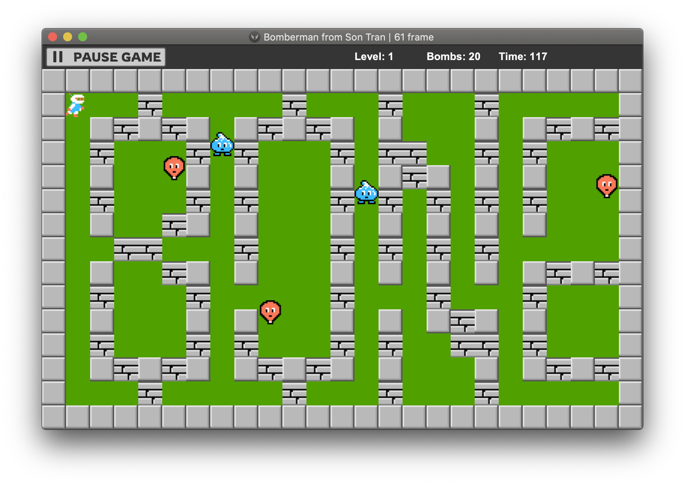

# OOP - Bomberman Game



## Demo Video

> https://youtu.be/YOI7DwaTPHA

## Installation

``` bash
# clone the repo
$ git clone https://github.com/ttsalpha/bomberman.git

# go into app's directory
$ cd bomberman

# determining the default JDK version
$ java -version
java version "15"
Java(TM) SE Runtime Environment (build 15)
Java HotSpot(TM) 64-Bit Server VM (build 23.2-b04, mixed mode)

# run maven
$ mvn clean javafx:run
```

## Project Structure

```
src/sontran
├── control
│   ├── Bocked.java 
│   ├── Menu.java 
│   └── Move.java
├── entities
│   ├── animal
│   │   ├── intelligent
│   │   │   ├── AStar.java
│   │   │   └── Node.java
│   │   ├── Animal.java  
│   │   ├── Ballom.java  
│   │   ├── Bomber.java  
│   │   ├── Doll.java  
│   │   ├── Kondoria.java  
│   │   └── Oneal.java  
│   ├── block
│   │   ├── Bomb.java  
│   │   ├── Brick.java  
│   │   ├── Grass.java  
│   │   ├── Portal.java  
│   │   └── Wall.java  
│   ├── item
│   │   ├── FlameItem.java  
│   │   ├── Items.java  
│   │   └── SpeedItem.java  
│   └── Entity.java  
├── graphics
│   ├── CreateMap.java  
│   ├── Sprite.java  
│   └── SpriteSheet.java  
├── level
│   ├── Level1.java  
│   ├── Level2.java  
│   ├── Level3.java  
│   └── NextLevel.java  
├── utility
│   └── SoundManager.java  
└── BombermanGame.java
```
